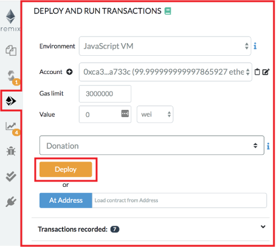
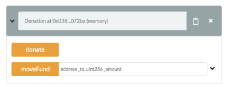
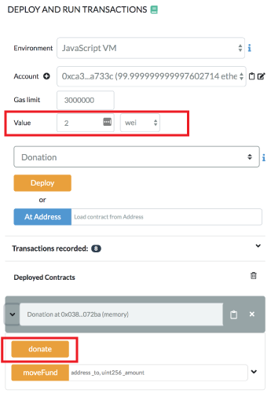

Debugging transactions
======================

There are two ways to start debugging, each one corresponds to a different use case.
* from the transaction log in the Terminal - use this when you are want to debug a "sucessful" transaction.
* from the Debugger - use this if you have a *transaction hash* or a *block number* with a *transaction index*.

### Debug from the Transaction GUI - 

Let's start with a basic contract (or replace this one by your own):
- create a blank file in the file explorer (by clicking the + icon) and give it a name.
- copy the code below.
- compile the code.
- click the Run & Deploy icon in the icon panel.

``` 
{.sourceCode .none}  - RS why is this here?
pragma solidity >=0.5.1 <0.6.0;
contract Donation {
    address owner;
    event fundMoved(address _to, uint _amount);
    modifier onlyowner { if (msg.sender == owner) _; }
    address[] _giver;
    uint[] _values;

    constructor() public {
        owner = msg.sender;
    }

    function donate() payable  public {
        addGiver(msg.value);
    }

    function moveFund(address payable _to, uint _amount) onlyowner  public {
        uint balance = address(this).balance;
        uint amount = _amount;
        if (_amount <= balance) {
            if (_to.send(balance)) {
                emit fundMoved(_to, _amount);    
            } else {
               revert();
            }
        } else {
            revert();
        }
    }

    function addGiver(uint _amount) internal {
        _giver.push(msg.sender);
        _values.push(_amount);
    }
}
```

For the purpose of this tutorial, we will run the `JavaScript VM`.
This simulates a custom blockchain. You could do the same using a proper backend node.

Let's deploy the contract:

Click the `Deploy` button



You'll see the deployed instance (AKA the udapp).


Then open it up (by clicking the caret).




We are going to call the `Donate` function and will send it ether.  

To do this: in the value input box put in **2** and select Ether as the unit (and not wei like I did in the image below - well you could - it won't really change anything).



Then click the `Donate` button.

This will send Ether to the this function.

Because we are using the `JavaScript VM`, everything happens almost instantly.  (If we had been using Injected Web 3, then we would have to need to approve the transaction, pay for gas and wait for the transaction to get mined.)

Remix displays information related to each transaction result in the terminal.

Check in the **terminal** where the transaction you just made is logged. 

Click the debug button to start debugging it.


### From the Debugger

Click the bug icon in the icon panel to get to the debugger in the side panel.  If you don't see the bug icon go to the plugin manager and activate the debugger.

You can start a debug session by providing either a `transaction hash`
or a `block number` and `transaction index`.

To find a transaction hash 
1. go to a transaction in the terminal.
2. Click a line with a transaction - to exand the log.
3. Copy the transaction has locate there.


Then click on the `start debugging` button.

Using the debugger
------------------

The debugger allows one to see detailed informations about the
transaction's execution. It uses the editor to display the
location in the source code where the current execution is.

The transaction panel displays basic information about the current
transaction.


The navigation part contains a slider and buttons that can be used to
step through the transaction execution.

From the left to the right:

step over back, step into back, step into forward, step over forward,
jump out (jump out of the current call), jump to the previous
breakpoint, jump to the next breakpoint.


11 panels give detailed information about the execution:

### Instructions


The Instructions panel displays the bytecode of the current executing
contract- with the current step highlighted.

Important note: When this panel is hidden, the slider will have a
courser granularity and only stop at *expression boundaries*, even if they
are compiled into multiple EVM instructions. When the panel is
displayed, it will be possible to step over every instruction, even
those that refers to the same expression.

### Solidity Locals


The Solidity Locals panel displays local variables associated with the
current context.

### Solidity State


The Solidity State panel displays state variables of the current
executing contract.

### Low level panels

These panels display low level informations about the execution:

> -   Stack
> -   Storages Changes
> -   Memory
> -   Call Data
> -   Call Stack
> -   Return Value (only if the current step is a RETURN opcode)
> -   Full Storages Changes (only at the end of the execution - display
>     every storage change of every modified contract)

### Reverted Transaction

A transaction could be `reverted` (because of an *out of gas exception* or
Solidity `revert` statement or because of a low level exception).

It is important to be aware of the exception and to locate
where the exception is in the source code.

Remix will warn you when the execution throws an exception. The
`warning` button will jump to the last opcode before the exception
happened.


### Breakpoints

The two last buttons from the navigation area are used to jump either
back to the previous breakpoint or forward to the next breakpoint.

Breakpoints can be added and removed by clicking on the line number in the *Editor*.


When using debug session with breakpoints, the execution will jump to the first
encountered breakpoint.

**Important note:** If you add a breakpoint to a line that declares a
variable, it might be triggered twice: Once for initializing the
variable to zero and second time for assigning the actual value. As an
example, assume you are debugging the following contract:

(RS - what is the {.sourceCode .none} doing?)
``` 
{.sourceCode .none}
pragma solidity >=0.5.1 <0.6.0;

contract ctr {
    function hid () public {
        uint p = 45;
        uint m;
        m = 89;
        uint l = 34;
    }
}
```

And let's says that breakpoints are set for the lines

`uint p = 45;`

`m = 89;`

`uint l = 34;`

then clicking on `Jump to next breakpoint` will stop at the following
lines in the given order:

> `uint p = 45;` (declaration of p)
>
> `uint l = 34;` (declaration of l)
>
> `uint p = 45;` (45 assigned to p)
>
> `m = 89;` (89 assigned to m)
>
> `uint l = 34;` (34 assigned to l)
